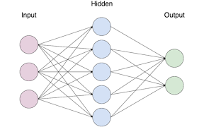

# Neural Net
***Wanted to create a network of my own design***

[Software Demo Video](https://youtu.be/JEaY07pHUNc)

# Development Environment

* VScode
* Andaconda
* python 3.9.12

## Installations
* Numpy
* matplotlib

## Basic Network

* 3 layers input, hidden, and output
* Each layer connected to each other
* Each of these connection or lines is what we would refer to as a unique weight
* Each node or circle is what we call a Unique Bias
* If we combined both the Biases and Wieghts, we get whats called params
* In total we have 25 different Weights and 10 different Biases whichs adds up to 35 params
* Each params affect each other

## Input layer
* Own data of what we are looking at
* Each of the 3 input circles for example could represent seprate data in a data set

## links
* [sentdex](https://www.youtube.com/watch?v=txh3TQDwP1g&list=PLQVvvaa0QuDcjD5BAw2DxE6OF2tius3V3&index=9)
* [valerio verlardo](https://www.youtube.com/watch?v=Z97XGNUUx9o&list=PL-wATfeyAMNrtbkCNsLcpoAyBBRJZVlnf&index=8)

# Future Work

* Complete the back propagation
* Add more actuvations
* add a class to handle most of the hands on stuff

